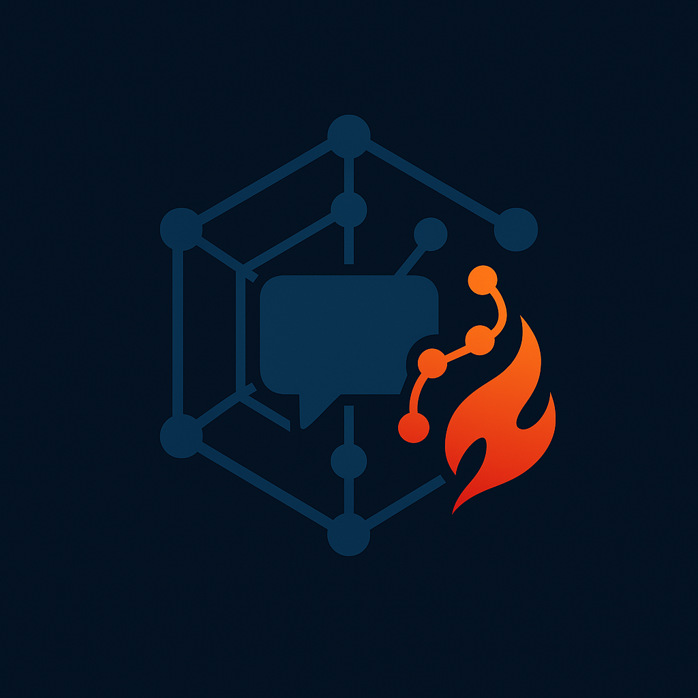
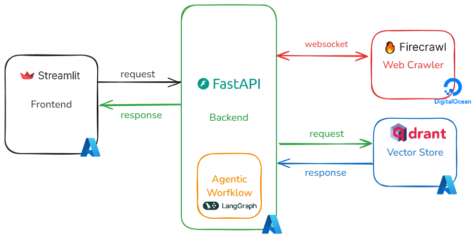
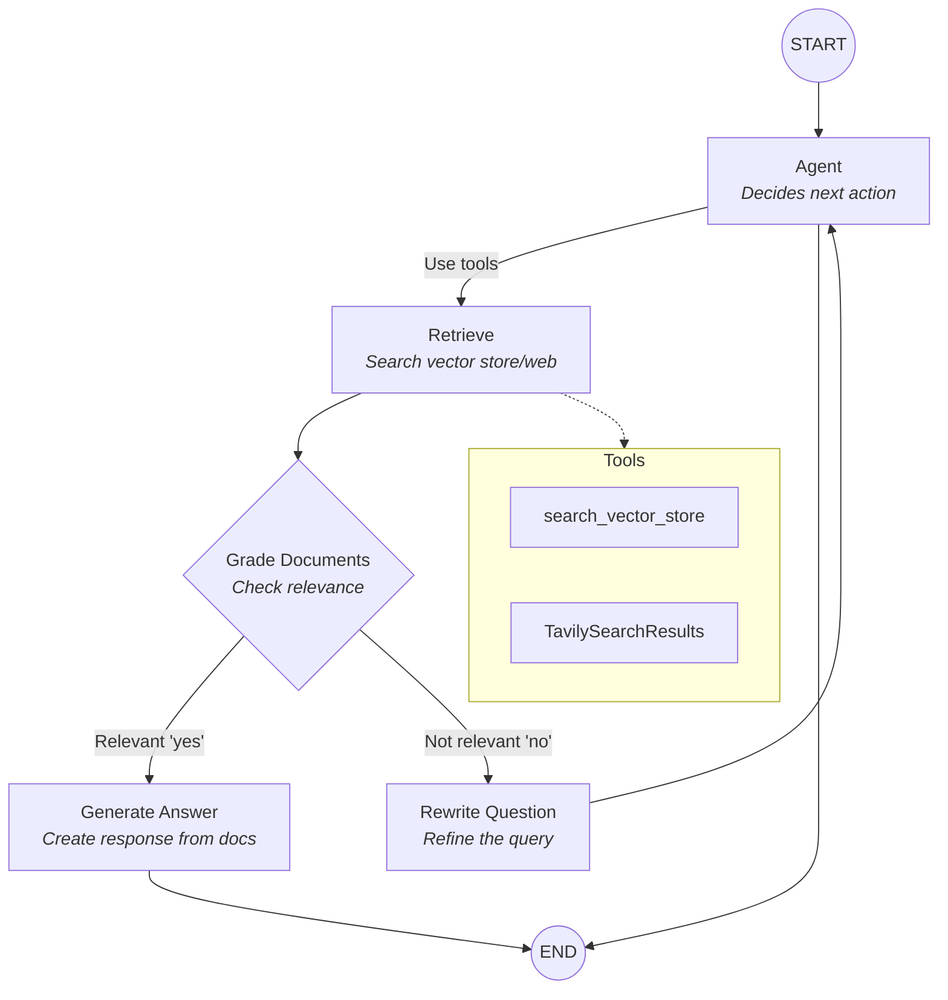
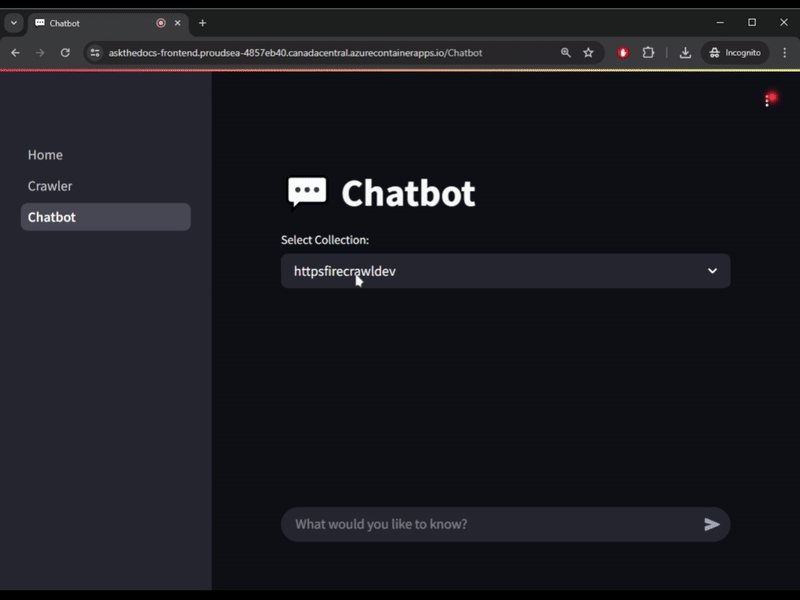
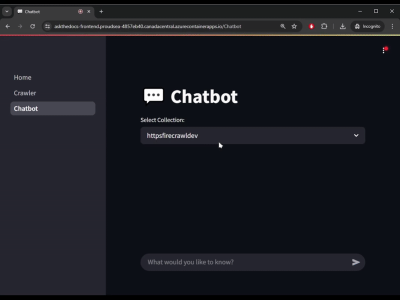

<a id="readme-top"></a>
<!-- PROJECT SHIELDS -->
[![Contributors][contributors-shield]][contributors-url]
[![LinkedIn][linkedin-shield]][linkedin-url]

<!-- PROJECT LOGO -->
<br />
<div align="center">
  <a href="https://github.com/shafiqninaba/ask-the-docs">
    
  </a>
<h3 align="center">Ask the Docs</h3>

  <p align="center">
    An application that uses an Agentic RAG pipeline to retrieve information from the vector store using Qdrant that contains crawled websites via Firecrawl.
    <br />
    <a href="https://askthedocs-frontend.proudsea-4857eb40.canadacentral.azurecontainerapps.io/">View Demo</a> (message me on <a href="https://linkedin.com/in/shafiq-ninaba">LinkedIn</a> for login password)
    <br>
    <a href="https://github.com/shafiqninaba/ask-the-docs/issues/new?labels=bug&template=bug-report---.md">Report Bug</a>
    &middot;
    <a href="https://github.com/shafiqninaba/ask-the-docs/issues/new?labels=enhancement&template=feature-request---.md">Request Feature</a>
  </p>
</div>

<!-- TABLE OF CONTENTS -->
<details>
  <summary>Table of Contents</summary>
  <ol>
    <li>
    <a href="#built-with">Built With</a>
    </li>
    <li>
      <a href="#about-the-project">About The Project</a>
      <ul>
        <li><a href="#description">Description</a></li>
        <li><a href="#data-pipeline">Data Pipeline</a></li>
        <li><a href="#retrieval-and-question-answering-pipeline">Retrieval and Question Answering Pipeline</a></li>
      </ul>
    </li>
    <li>
      <a href="#getting-started">Getting Started</a>
      <ul>
        <li><a href="#prerequisites">Prerequisites</a></li>
        <li><a href="#installation-and-commands">Installation and Commands</a></li>
      </ul>
    </li>
    <li><a href="#usage">Usage</a></li>
    <li><a href="#demo">Demo</a></li>
    <li><a href="#contact">Contact</a></li>
  </ol>
</details>

## Built With

* [![Python][Python-img]][Python-url]
* [![uv][uv-img]][uv-url]
* <a href="https://www.langchain.com/langgraph"></a>
* [![OpenAI][openai-img]][openai-url]
* <a href="https://qdrant.tech/"></a>
* [![Streamlit][streamlit-img]][streamlit-url]
* <a href="https://tavily.com/"></a>
* <a href="https://www.firecrawl.dev/"></a>
* <a href="https://azure.microsoft.com/"></a>
* [![DigitalOcean][digitalocean-img]][digitalocean-url]

<!-- ABOUT THE PROJECT -->
## About The Project

[![Product Name Screen Shot][product-screenshot]](https://askthedocs-frontend.proudsea-4857eb40.canadacentral.azurecontainerapps.io/)

This is a personal project to demonstrate the use of an agentic Retrieval-Augmented Generation (RAG) workflow for a chatbot that helps users find more information about the websites that the user has sent for crawling. The chatbot is built using `LangGraph`, `OpenAI`'s `GPT-4o-mini` for the chat model, `Qdrant` (self-hosted) for the vector store and `Firecrawl` (self-hosted) for the web crawling service.

The use case for this project is to provide a chatbot that can answer questions about the documentation of a website. Most of the time, documentation can get really convoluted and is hard to navigate. This app aims to provide a solution to this problem by allowing users to crawl the documentation of a website and then ask questions about it. The chatbot will then use the crawled data to answer the questions via an agentic RAG pipeline.

The app is hosted on `Azure` and can be accessed [here](https://askthedocs-frontend.proudsea-4857eb40.canadacentral.azurecontainerapps.io/). The app is password-protected, so please message me on [LinkedIn](https://linkedin.com/in/shafiq-ninaba) for the password.

### Description

#### Software Architecture

The diagram below shows the high-level architecture of the application.



##### Key Components

- **Frontend**: The frontend is built using `Streamlit` and is hosted on `Azure`. It provides a user interface for the chatbot and crawling service. The frontend is responsible for sending requests to the backend and displaying the responses.
- **Backend**: The backend is built using `FastAPI` and is hosted on `Azure`. It provides an API for the frontend to interact with the chatbot and crawling service. The backend is responsible for processing the requests and sending them to the appropriate services:
   - **Crawling Service**: The crawling service is built using `Firecrawl` and self-hosted on a virtual machine on `DigitalOcean` and is responsible for crawling the websites that the user sends. It stores the crawled data in a vector store (`Qdrant`) for later retrieval.
   - **Vector Store**: The vector store is built using `Qdrant` and self-hosted on `Azure Container Apps` and is responsible for storing the crawled data in a vector format. It provides an API for the backend to retrieve the data based on the user's queries.
   - **Chatbot**: The chatbot is built using `LangGraph` and `OpenAI`'s `GPT-4o-mini` model. It provides an API for the frontend to interact with the chatbot and retrieve information from the vector store. This API streams the responses to the frontend in real-time, allowing the user to see the steps the chatbot is taking to answer the question.

#### Agentic RAG Pipeline

The application implements an advanced agentic RAG (Retrieval-Augmented Generation) pipeline powered by `LangGraph` to intelligently retrieve information and generate high-quality responses. The system employs a sophisticated workflow with multiple specialized components that work together to deliver accurate answers.



##### Key Components

- **Agent**: The orchestrator of the workflow, implemented using `LangChain`'s `ChatOpenAI` (gpt-4o-mini) with tool binding capabilities. The agent evaluates the user's query and makes intelligent decisions about whether to use retrieval tools or generate a direct response. It serves as the central routing mechanism in the graph.
- **Retrieval**: Implemented as a `ToolNode` with access to two distinct information sources:
  - **Vector Store Search**: Queries the application's vector database to find relevant document chunks from ingested documentation.
  - **`Tavily` Web Search**: Provides fallback capability when the vector store doesn't contain sufficient information.
- **Grade Documents**: A critical quality control component that uses `GPT-4o` to evaluate the relevance of retrieved documents. This conditional edge in the workflow determines whether to proceed with response generation or refine the query, ensuring only high-quality information reaches the user.
- **Generate**: The final stage in the workflow, using a RAG-optimized prompt template with `GPT-4o-mini` to synthesize retrieved information into a coherent, informative response that directly addresses the user's question.

The entire workflow is orchestrated through `LangGraph`'s `StateGraph` system, which manages the flow of information between components and maintains conversation state. This architecture enables dynamic decision-making based on document relevance and query quality, significantly improving the accuracy and helpfulness of responses compared to traditional RAG systems.

<p align="right">(<a href="#readme-top">back to top</a>)</p>

<!-- DEMO -->
## Demo

The gifs below showcase the key features of the application, including the document crawling and indexing process, the agentic RAG chatbot interaction, and the web search fallback capability.

### Firecrawl Demo

<div align="center">
   <p><em>Figure 1: Document Crawling and Indexing Process</em></p>
</div>

This gif shows the document crawling and indexing functionality in action. When a user inputs a URL, the `Firecrawl` web crawling service that is self-hosted on `DigitalOcean` efficiently traverses through documentation sources, extracting relevant content, and processes it for the vector database. This automated process ensures that all documentation is properly indexed and ready for semantic search and retrieval.

### Agentic RAG Chatbot Demo

<div align="center">
   <p><em>Figure 2: Agentic RAG Chatbot Interaction</em></p>
</div>

The chatbot interaction demonstrates the agentic RAG pipeline in practice. Users can ask complex questions about the documentation, and the system intelligently processes these queries, retrieves relevant information from the vector store, and generates comprehensive, accurate responses. Note how the system handles follow-up questions and maintains context throughout the conversation.

### Web Search Fallback Capability

<div align="center">
   <p><em>Figure 3: Web Search Fallback Capability</em></p>
</div>

When information isn't available in the indexed documentation, the system seamlessly falls back to web search capabilities. This demonstration shows how the application leverages Tavily web search to supplement its knowledge base, ensuring users receive helpful responses even for queries that go beyond the scope of the ingested documentation.

<p align="right">(<a href="#readme-top">back to top</a>)</p>

<!-- GETTING STARTED -->
## Getting Started

To get a local copy up and running follow these simple steps.

### Prerequisites

- [Python](https://www.python.org/) 3.8 or higher
- [uv](https://docs.astral.sh/uv/) package manager
- [Firecrawl](https://www.firecrawl.dev/) (self-hosted) for web crawling
- [Qdrant](https://qdrant.tech/) (self-hosted) for vector storage
- [OpenAI API](https://platform.openai.com/) Key
- [Qdrant API](https://qdrant.tech/) Key
- [Tavily API](https://tavily.com/) Key
- [Docker](https://www.docker.com/) to run the application locally

### Installation and Commands

1. Clone the repo
   ```sh
   git clone https://github.com/shafiqninaba/ask-the-docs.git
   ```
2. Install dependencies
   ```sh
   uv sync
   ```
3. Enter your API credentials in `.env`
   ```
   FIRECRAWL_API_URL=<your-self-hosted-firecrawl-url>
   QDRANT_URL=<your-self-hosted-qdrant-url>
   OPENAI_API_KEY=<your-openai-api-key>
   TAVILY_API_KEY=<your-tavily-api-key>
   FASTAPI_BACKEND=<your-fastapi-backend-url>
   ```
4. Change git remote url to avoid accidental pushes to base project
   ```sh
   git remote set-url origin shafiqninaba/ask-the-docs
   git remote -v # confirm the changes
   ```
5. Run the application locally using Docker
   ```sh
   docker compose up
   ```
6. Access the application at `http://localhost:8501`

<p align="right">(<a href="#readme-top">back to top</a>)</p>

<!-- CONTACT -->
## Contact

<a href="https://github.com/shafiqninaba/ask-the-docs/graphs/contributors">
  
</a>

Shafiq Ninaba | shafiqninaba@gmail.com | [LinkedIn](https://linkedin.com/in/shafiq-ninaba)

<p align="right">(<a href="#readme-top">back to top</a>)</p>

<!-- MARKDOWN LINKS & IMAGES -->
<!-- https://www.markdownguide.org/basic-syntax/#reference-style-links -->
[contributors-shield]: https://img.shields.io/github/contributors/shafiqninaba/ask-the-docs.svg?style=for-the-badge
[contributors-url]: https://github.com/shafiqninaba/ask-the-docs/graphs/contributors
[forks-shield]: https://img.shields.io/github/forks/shafiqninaba/ask-the-docs.svg?style=for-the-badge
[forks-url]: https://github.com/shafiqninaba/ask-the-docs/network/members
[stars-shield]: https://img.shields.io/github/stars/shafiqninaba/ask-the-docs.svg?style=for-the-badge
[stars-url]: https://github.com/shafiqninaba/ask-the-docs/stargazers
[issues-shield]: https://img.shields.io/github/issues/shafiqninaba/ask-the-docs.svg?style=for-the-badge
[issues-url]: https://github.com/shafiqninaba/ask-the-docs/issues
[linkedin-shield]: https://img.shields.io/badge/-LinkedIn-black.svg?style=for-the-badge&logo=linkedin&colorB=555
[linkedin-url]: https://linkedin.com/in/shafiq-ninaba
[product-screenshot]: assets/images/homepage.jpg
[Python-img]: https://img.shields.io/badge/python-3670A0?style=for-the-badge&logo=python&logoColor=ffdd54
[Python-url]: https://www.python.org/
[uv-img]: https://img.shields.io/badge/uv-package%20manager-blueviolet
[uv-url]: https://docs.astral.sh/uv/
[openai-img]: https://shields.io/badge/-OpenAI-93f6ef?logo=openai
[openai-url]: https://platform.openai.com/
[streamlit-img]: https://img.shields.io/badge/-Streamlit-FF4B4B?style=flat&logo=streamlit&logoColor=white
[streamlit-url]: https://streamlit.io/
[digitalocean-img]: https://img.shields.io/badge/DigitalOcean-0080FF?style=for-the-badge&logo=digitalocean&logoColor=white
[digitalocean-url]: https://www.digitalocean.com/
